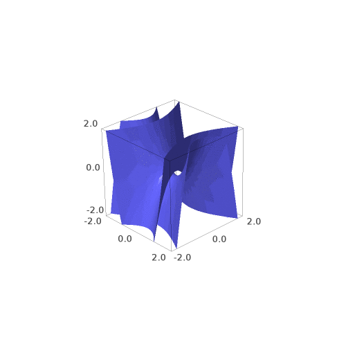

These pictures intend to show that the elementary rewrite used for duplication in systems such as linear logic, optimal reduction of lambda terms, and chemlambda, manifests itself topologically as a single elementary singularity/bifurcation/modification of a surface as the surface collides with itself, or in other words as the surface is pinched along the z-axis.

Furthermore the 3d representation resolves the crossing that is necessary in 2d presentations. This is done by dissociating that single dimension which in the 2d setting is involved with both duplication and composition nodes, into two separate dimensions.

The first picture is an animation which shows the local surface modification taking place.

The following 3d models provide a more zoomed-out, global view of the surface before and after the rewrite.
[3d model before rewrite](viewer.html?obj=212-textured.obj&tex=212-textured.png)

[3d model after rewrite](viewer.html?obj=242-textured.obj&tex=242-textured.png)

Some coloring has been added to the surface as decoration, amounting to a sort of string diagram embedded in the surface. The rewrite (including the decoration) can be said to take place in a suitable 4-category.
