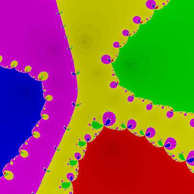
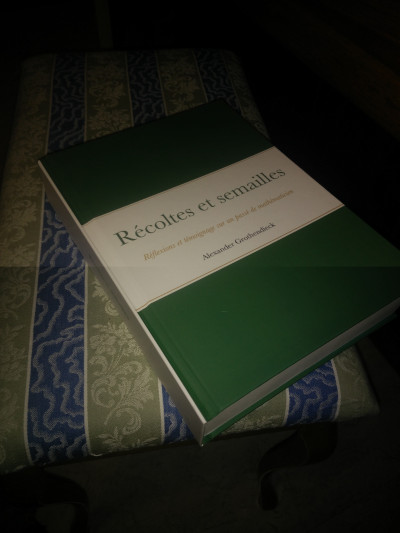
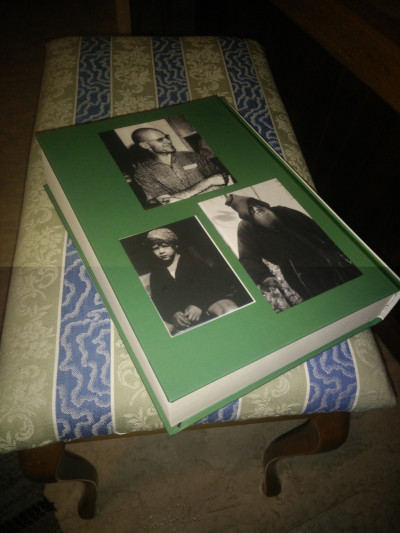
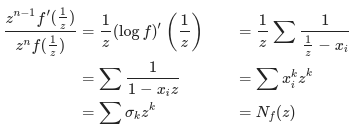
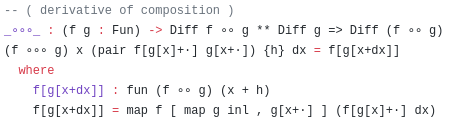
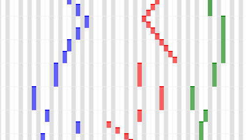

## Math projects

| ------------- |:-------------:|
| Here's an online [Newton fractal exporer](newton.html). Requires multitouch. |  |
| I have started a [book translation project](https://github.com/JoelSjogren/translations/blob/main/recoltes-et-semailles/README.md). |   |
| I used to have a [math blog](http://geq-i.blogspot.com/). |  |
| Sketch of a 'type theoretic' notion of [functor differentiation](https://github.com/JoelSjogren/diff-functor/blob/master/DiffFunctor.agda), with a proof of the chain rule. |  |

## Music projects
| ------------- |:-------------:|
| There is also some ['sheetmusic'](sheetmusic/index.html). |  |
| (Working on another project...) | |

## Web hacks
 * a (special-purpose) **subtitle overlay** extension to Chrome ([link](https://github.com/JoelSjogren/most))
 * another extension which **removes some ads** from a dictionary website ([link](https://github.com/JoelSjogren/trim))
 * contributed to an extension which **cleans up** wiktionary entries ([link](https://github.com/JoelSjogren/WiktionaryLanguageFilter))

## C++ projects
A long time ago I used C++, and wrote these things:
 * a tiny library for modifying terminal colors ([link](https://github.com/JoelSjogren/libquick/blob/master/colormod.h))
 * a window duplicator (you never know when you might need one...) ([link](https://github.com/JoelSjogren/window-copy))
 * a program which reads a torrent file and outputs empty files ([link](https://github.com/JoelSjogren/torrent-touch))
 * a fairly sophisticated video organizer ([link](https://github.com/JoelSjogren/video-organizer))
